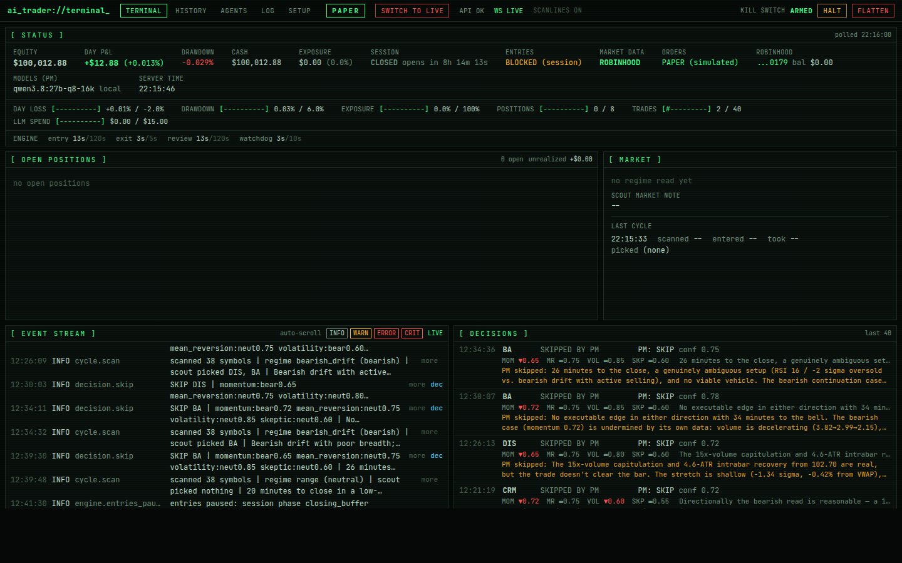

# AI Trader

An intraday trading engine where **LLM agents make the trading decisions** and **code enforces a hard risk envelope**.
Stocks and long options through Robinhood's agentic-trading MCP server, with models running locally (Ollama, vLLM) or
hosted (OpenRouter). Every action traces back to the exact reasoning and prompts behind it. Agents act only inside the
trading window, positions never stay overnight, and there is a kill switch.



> **Read this first.** Robinhood's agentic MCP has **no paper mode**: anything sent through it is a real order with
> real money. This project ships its own paper broker (real Robinhood quotes in, pessimistic simulated fills out), and
> paper is the default. Live mode sits behind several gates. No trading system, AI or otherwise, is guaranteed to make
> money: the envelope bounds how much a bad day costs, it does not make days good.

## How it works

```
every 2 min (entry loop)                                           every 5 s (exit loop, no model)
  scanner measures the whole universe                                stop / target / thesis levels the agents set
  -> regime agent         what kind of day is it                     + hard backstops: premium stop, profit ceiling,
  -> scout agent          which few symbols deserve a look             max hold, expiry, end-of-day flatten, kill switch
     + catalysts (news, earnings) + option shortlist
  -> momentum | mean_reversion | volatility   (parallel)           every 2 min (review loop)
  -> skeptic              strongest honest case against              position manager: hold / tighten / extend / exit
  -> portfolio manager    enter or skip, vehicle, contract,          (may only reduce risk; code enforces that)
                          stop, target, size, hold time
  -> planner (code)       arithmetic, clamped into the envelope    after every close
  -> risk envelope        every rule evaluated and recorded          reviewer writes a lesson -> fed back to the PM
  -> executor             marketable limit, never chased
```

**Judgment lives in prompts, taught by worked examples** (`backend/app/agents/prompts/`), not in coded thresholds.
**Only the hard guarantees are code**: capped loss per trade and per day, long options only, nothing overnight, stops
that only tighten, reconciliation with the broker, and the kill switch.

## Getting started

Needs [uv](https://docs.astral.sh/uv/), Node.js 22, and for real agents either [Ollama](https://ollama.com) 0.34+ with
a ~32 GB GPU or an [OpenRouter](https://openrouter.ai) key. Full walkthrough: **[docs/GETTING_STARTED.md](docs/GETTING_STARTED.md)**.

```bash
git clone git@github.com:towardsautonomy/ai-trader.git && cd ai-trader
cp backend/.env.example backend/.env

# 1. See it run: synthetic market, no keys, trades within seconds
./trader start --demo                      # then open http://<this-machine>:3400

# 2. A real model (local example; see docs/LOCAL_MODELS.md)
./trader llm pull qwen3.8:27b-q8_0
printf 'FROM qwen3.8:27b-q8_0\nPARAMETER num_ctx 16384\n' > /tmp/Modelfile && ollama create qwen3.8:27b-q8-16k -f /tmp/Modelfile
./trader llm test local/qwen3.8:27b-q8-16k NVDA

# 3. Robinhood data (read-only; nothing is placed)
./trader robinhood login && ./trader robinhood discover && ./trader robinhood verify

# 4. Paper trading on real data
./trader restart --data robinhood --llm local/qwen3.8:27b-q8-16k
```

Going live is a button in the terminal (**SWITCH TO LIVE**), available only when every readiness check passes, and it
needs a one-time code from `./trader live-code` on the server. See [docs/RISK_AND_SAFETY.md](docs/RISK_AND_SAFETY.md).

Everyday commands: `./trader status | logs -f | kill [--flatten] | rearm | stop | doctor | test`.

## Documentation

| Doc | What's in it |
|---|---|
| [GETTING_STARTED.md](docs/GETTING_STARTED.md) | install, first run, models, Robinhood, paper trading, going live, commands |
| [ARCHITECTURE.md](docs/ARCHITECTURE.md) | components, the four loops, an entry cycle step by step, code layout, database, API |
| [AGENTS.md](docs/AGENTS.md) | the nine agents, prompts as worked examples, models and thinking, how model failures are caught |
| [RISK_AND_SAFETY.md](docs/RISK_AND_SAFETY.md) | the hard envelope, kill switch, live gates, the dashboard mode switch, known limits |
| [MARKET_DATA_AND_EXECUTION.md](docs/MARKET_DATA_AND_EXECUTION.md) | data sources, option shortlist, planner, orders, the paper broker |
| [ROBINHOOD.md](docs/ROBINHOOD.md) | login, discover, verify, which Robinhood tools are used and how |
| [LOCAL_MODELS.md](docs/LOCAL_MODELS.md) | Ollama and vLLM setup, recommended model, speeds, what weaker models get wrong |
| [DASHBOARD.md](docs/DASHBOARD.md) | the terminal's pages: terminal, history, setup, traces |
| [TESTING.md](docs/TESTING.md) | the test suite and the real-system checks |
| [BUILD_STATUS.md](docs/BUILD_STATUS.md) | what is done, what was found in real runs, what is open |

## Status

Paper trading on real Robinhood data with a local 27B model ran its first full session on 2026-09-23 with zero errors.
Login, discovery and verification pass against Robinhood's real server. A real order has not been placed yet: placed
order replies, option fills and non-empty positions are unproven until then. See [BUILD_STATUS.md](docs/BUILD_STATUS.md).
