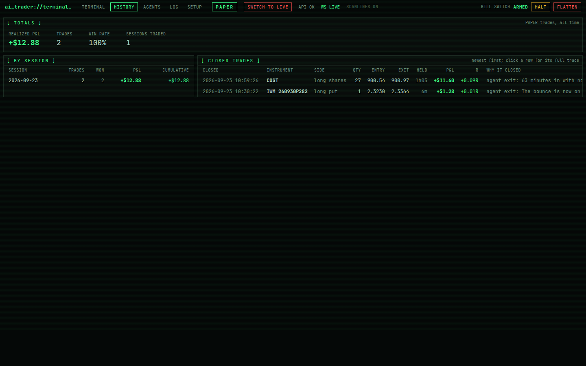
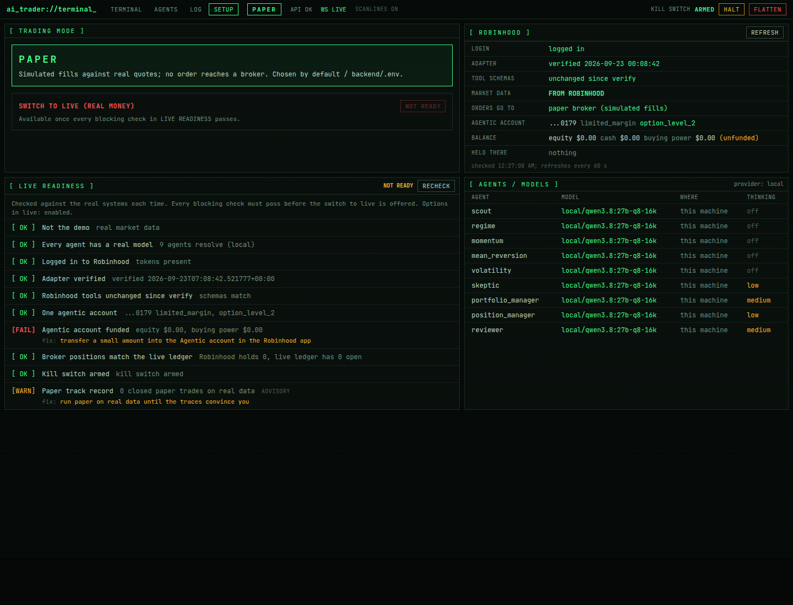

# The terminal (dashboard)

`http://<machine>:3400`. Everything refreshes by itself; events arrive over a WebSocket.

The header, on every page: the pages, the mode badge (PAPER, LIVE: REAL MONEY, or DEMO), a **SWITCH TO LIVE** /
**SWITCH TO PAPER** button, API and WebSocket health, and the kill switch (HALT, FLATTEN; Shift+K).

## TERMINAL

- **Status**: equity, day P&L for the current (or last) session, drawdown, cash, exposure, session phase and countdown,
  whether entries are allowed, **market data** source (ROBINHOOD / YFINANCE / SYNTHETIC), where **orders** go (paper or
  Robinhood), the **Robinhood** agentic account and its balance, and the portfolio manager's **model** (hover for every
  agent's). Meters show each hard limit's usage; ENGINE shows how long since each loop last ran. Banners appear for the
  demo, a refused live start, an offline model, or an unreachable broker.
- **Open positions**, with live P&L, stop, target and a close button.
- **Market**: the regime agent's read and the scout's note (kept across restarts within the day).
- **Event stream**: everything the engine does; long messages fold to two lines ("more").
- **Decisions**: every deliberation, each specialist's stance and confidence, and the portfolio manager's call.
- **Equity** curve and **Performance** summary.

Click a decision or a position for its **trace**: the candidate's data, catalysts, each agent's opinion, the option
shortlist, the plan and every clamp, each risk rule's result, the orders and fills, every review and the lesson, and for
each model call the exact prompt and reply (including thinking).

## HISTORY

Realised P&L, trade count and win rate; P&L per trading session with a running total; every closed trade with exact
fill prices (four decimals for options), holding time, P&L in dollars and in R, and why it closed. Rows open the trace.

## SETUP

- **Trading mode**, and the guarded switch (see [RISK_AND_SAFETY.md](RISK_AND_SAFETY.md)).
- **Robinhood**: login, verify time, whether the tool schemas changed, where data and orders go, the agentic account,
  its balance and holdings.
- **Live readiness**: each check against the real systems, with the command that fixes a failing one.
- **Agents / models**: each agent's model, where it runs, and its thinking level.

## AGENTS and LOG

AGENTS: each agent's realised track record and the reviewer's lessons. LOG: the full event log with paging and search.
